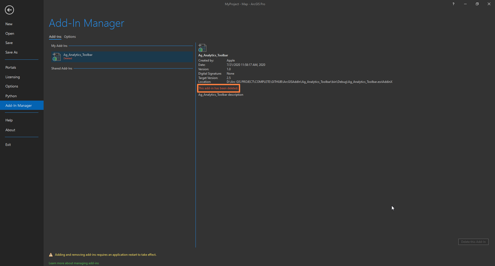
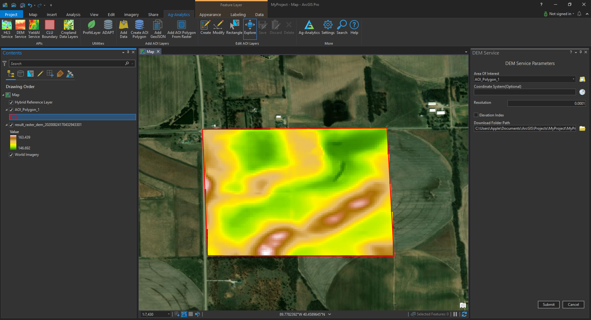
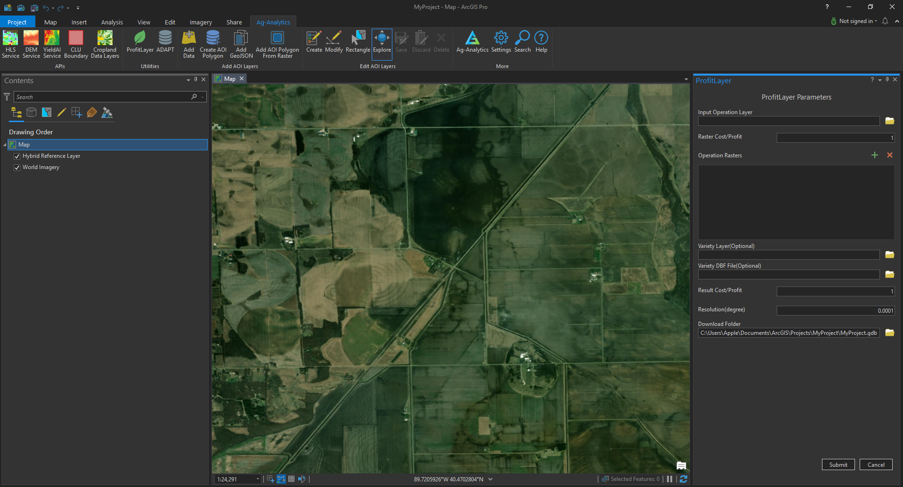

# ArcGIS-Pro-Add-in-Tool

### Table of Contents

- [1. Overview.](#1.-Overview.)
- [2. Installation](#2.-Installation.)
- [3. Usage](#3.-Usage)

## 1. Overview.

This program is a system that allows you to submit and download various useful geographic data from many kinds of APIs provided by Ag-Analytics services on ArcGIS Pro.

Ag-Analytics Farm Management Platform provides a wide range of services and data products with precision field data integration for farmers, retailers, suppliers and more.

For example, HLS (Specially Harmonized Landsat Sentinel) service, YieldAI, DEM (Digital Elevation Model) service, BoundaryAI, Cropland Data Layers, ProfitLayer, ADAPT, etc.

ArcGIS Pro users can access easily to Ag-Analytics APIs from extended add-in toolbar on ArcGIS Pro and also process, manage, analysis about various api service data on ArcGIS Pro platform.

This program will be help for ArcGIS pro users who want to use Ag-Analytics API.

## 2. Installation

To use the ArcGIS pro Toolbar function, the following environments must be installed.
> 1) ArcGIS Pro 2.6 install
[ArcGIS Pro 2.6 install](https://pro.arcgis.com/en/pro-app/get-started/install-and-sign-in-to-arcgis-pro.htm)
> 2) .Net framework4.8 
[.Net framework4.8 Download](https://dotnet.microsoft.com/download/)
> 3) Visual studio 2019 install (for developers)
[Visual Studio 2019 Download](https://visualstudio.microsoft.com/downloads/)
> 4) How to add toolbar on arcgis pro
[Intructions](https://awesomeopensource.com/project/Esri/arcgis-pro-sdk-community-samples/) 

## How to add toolbar on arcgispro

   1) Please download source code with zip file on git

      If you are not developer, you can only download Ag_Analytics_Toolbar/[bin/Debug]/Ag_Analytics_Toolbar.esriAddinX

      If Ag_Analytics_Toolbar.esriAddinX file dosn't exsist, please download source code with zip file.

   2) Please save zip file in your favorite directory

   3) Please unzip in same directory.

      If Ag_Analytics_Toolbar.esriAddinX file doesn't exsist in Ag_Analytics_Toolbar/[bin/Debug] directory, you can rebuild again on visual studio.

   4) Adding add-in toolbar on ArcGIS Pro.

      Please run Ag_Analytics_Toolbar.sln file on visual studio platform.

      Click rebuild on Build menu of visual studio, and then run by start button.

      If you don't want to use visual studio, please refer to below instructions.

### Set up add-ins

   1) Please run ArcGIS Pro on your pc.

   2) Go to ArcGIS Pro/Project tab/Add-In Manager.

      When you open the Add-In Manager page, ArcGIS Pro searches specified well-known folders for add-in files.
   
      After the files are located, they are installed and appear on the Add-Ins tab of the Add-In Manager.
   
      The Add-Ins tab provides information about available add-ins.

   

   3) You can see registered add-ins, and remove add-in if you installed old version.

      You can delete local add-ins from the Add-In Manager.
    

    

      The add-in is marked with a message that it has been deleted. 
      
      It is still visible in the Add-In Manager and is available in the current ArcGIS Pro session.
    
   
   
   4) Setting add-in toolbar  in Option tab
      
      ArcGIS Pro searches these folders for add-ins each time you start the application. 
      
      This option is useful if you use a network location to share add-ins within your organization.

   
      

   5) Restart ArcGIS Pro.

         Noted : If you do not understand this process, please refer to the following link.
   [get-started](https://pro.arcgis.com/en/pro-app/get-started/manage-add-ins.htm)

         Or you can see and refer to our videos.
   
      More details is shown in video link for how to add add-in toolbar on arcgis pro.[[How to add add-in toolbar on arcgis pro Video](https://www.dropbox.com/s/gvrqmmw56vq0up1/how%20to%20add%20add-in%20toolbar%20on%20arcgis%20pro.mp4?dl=0)]

## 3. Usage

   1) How to login.

   2) How to use HLS service

      The Ag-Analytics HLS API provides service in which a user can provide a polygon in specific formats with additional customized options to retrieve the dynamics of their land at various times from the Landsat-8 and Sentinel-2 satellites. 
      
      This service provides information on cloud cover, statistics, Normalized Difference Vegetation Index in addition to MSI bands information.
      
      Noted : If you want to know more details , please refer to the following link. [[Ag-Analytics HLS-Service](https://ag-analytics.portal.azure-api.net/docs/services/harmonized-landsat-sentinel-service/operations/hls-service)]
   
      Most of Ag-analytics APIs require AOI(Area Of Interest) of raster format(.tif), vector format(shapefile), GeoJSON format(.geojson), so Ag-analytics add-in toolbar provide adding/editing/converting aoi polygons from polygon feature classes/raster dataset in geodatabase, shapefile(.shp), raster(.tif), GeoJSON(.geojson) in directory  on arcgis pro.

      Ag-analytics APIs provide also to dwonload result files such as raster format(.tif), vector format(zipped shapefile).

      ArcgGIS pro Ag-analytics toolbar provide to download in your geodatabase or folder API result, and then load api result of raster or vector format with approximate symbology on ArcGIS Pro users can see download progressing from video link of every API.

      

      More details is shown in video link for Ag-analytics HLS servce.

      If you want to know how to use HLS service on Ag-analytics toolbar of ArcGIS Pro, please refer to the following this Video [[Ag-Analytics HLS-Service Video](https://www.dropbox.com/s/skmu2k7kpf9snq0/HLS%20service%20.mp4?dl=0)]
      
   3) How to use DEM service

      The Ag-Analytics® DEM Service API allows for clipping boundaries to the 10 meter USGS DEM map of the United States. 
      
      The service consists of a POST request where the user can pass a GeoJSON boundary, desired output projection as an EPSG code, and a resolution in degrees lat/lon.

      Noted : If you want to know more details , please refer to the following link.

      
          
      If you want to know how to use DEM service on Ag-analytics toolbar of ArcGIS Pro, please refer to the following this Video.[[Ag-Analytics DEM service Video](https://www.dropbox.com/s/tkl3iw2y95ghacy/DEM%20Service.mp4?dl=0)]

   4) How to use YieldAI service

      The Ag-Analytics® Yield Forecast API uses Artificial Intelligence algorithms to forecast the yield on a given field, based on geospatial data.

      Noted : If you want to know more details, please refer to the following link. [[Ag-Analytics YieldAI service](https://ag-analytics.portal.azure-api.net/docs/services/dem-service/operations/dem-service)]

      

      If you want to know how to use YieldAI service on Ag-analytics toolbar of ArcGIS Pro, please refer to the following this Video. [Coming soon]
   

   5) How to use ADAPT service 

      
      
      Note: If you download adapt zipped file in any geodatabase, files is saved in not only your geodatabase also your arcgis project directory with new directory name.

      If you want to know how to use ADAPT service on Ag-analytics toolbar of ArcGIS Pro, please refer to the following this Video.[[Ag-Analytics ADAPT service Video](https://www.dropbox.com/s/2250wjdkpa4o1o5/ADAPT%20Service.mp4?dl=0)]

   6) How to use ProfitLayer service 

      

      If you want to know how to use ProfitLayer service on Ag-analytics toolbar of ArcGIS Pro, please refer to the following this Video.[[Ag-Analytics ProfitLayer service Video](https://www.dropbox.com/s/y63hm210qzy7jvb/ProfitLayer%20Service.mp4?dl=0)]
    

